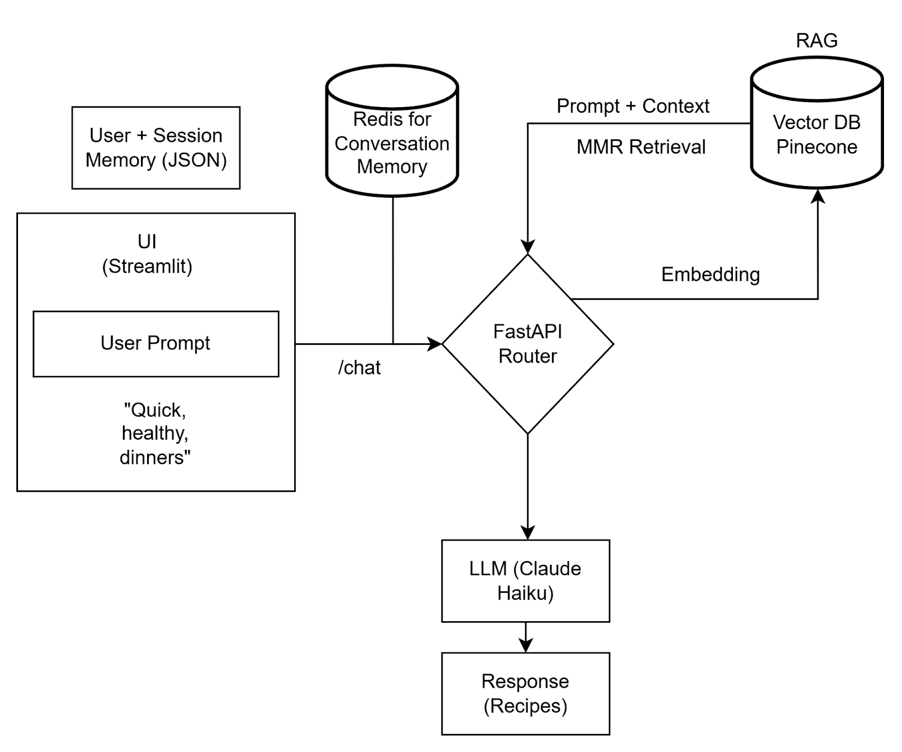

# Meal Planning Assistant 🍽️

An AI-powered meal planning assistant that suggests personalized recipes based on available ingredients, dietary preferences, nutritional goals, and time constraints.

## Project Description

This system leverages RAG (Retrieval-Augmented Generation) and agentic workflows to provide context-aware recipe recommendations. The assistant reasons across multiple data sources—user preferences, past meal history, and a recipe database—to deliver personalized meal suggestions that fit your lifestyle.

## Project Outcomes

### Implemented Workflows
- **Recipe Retrieval & Answering (RAG)**: Semantic search over recipe database using vector embeddings to find relevant recipes based on user constraints
- **Multi-Context Reasoning**: Agent synthesizes information from user preferences, dietary restrictions, past conversations, and available ingredients
- **Structured Recommendation Pipeline**: 
  1. Retrieves top 5 candidate recipes via semantic search
  2. Reasons about best options given user context
  3. Fetches additional metadata (nutrition info, cooking steps, ingredient substitutions) via API endpoints
  4. Generates comprehensive, personalized response

### Planned Workflows
- **Tool Integration**: Notion for meal logging, Google Calendar for scheduling
- **Preference Learning**: Continuous personalization from user feedback
- **Shopping List Generation**: Automated grocery lists based on meal plans

## Project Practicality

**Personal Use Case**: As someone who lacks time to plan varied, healthy meals, this assistant automates the mental overhead of meal planning. It ensures I eat diverse, nutritious meals without the cognitive load of recipe discovery and constraint-matching.

**Key Benefits**:
- Reduces decision fatigue around "what to cook"
- Ensures dietary goals are met (nutrition, restrictions)
- Minimizes food waste by suggesting recipes for available ingredients
- Adapts to personal taste over time

## Tech Stack

- **LLM**: Claude (Anthropic)
- **Vector Database**: Chroma
- **Framework**: LangChain
- **Backend**: Python (migrating to FastAPI)
- **Frontend**: Streamlit (migrating to React/TypeScript)

## System Architecture (Current)

## References & Resources

- [LangChain Documentation](https://python.langchain.com/)
- [Chroma Vector Database](https://www.trychroma.com/)
- [Anthropic Claude API](https://docs.anthropic.com/)
- [RAG Overview - LangChain](https://python.langchain.com/docs/tutorials/rag/)

## Acknowledgements

Developed as part of Aadi's Anote AI Academy Capstone Project, focusing on practical applications of LLMs, RAG systems, and agentic workflows. Huge thanks to the Anote team for their support!

---

*This is an evolving project—documentation and features will be expanded as development progresses.*
